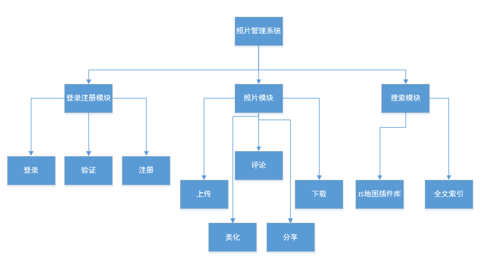

## 软件工程项目

### 说明
- 项目地址：http://tmn07.ren/PMS
- 目前配置好了服务器，opencv等，具体开发即将进行
- doc里将放置各种文档和文档链接的资源。
- 其他将来在说明~

*****
以下是开题报告
## 照片管理系统

大多数用户出差旅游都喜欢应用手机拍照，但是由于网络限制或隐私限制很难将照片传到网上。由于目前缺少能够标示照片拍摄位置和心情的软件，使得当用户回家后很难对照片拍摄时的地点和心情进行整理。因此希望大家开发照片管理系统，按拍照位置管理照片（地图展示），并可以添加评论，对照片美化。

功能至少包括：按地图归类照片，添加评论及心情，按评论检索，美化照片，网络同步。

11周中检
15周结题

### 对题目的理解

大多数用户出差旅游都喜欢应用手机拍照，但是由于网络限制或隐私限制很难将照片传到网上。由于目前缺少能够标示照片拍摄位置和心情的软件，使得当用户回家后很难对照片拍摄时的地点和心情进行整理。

### 功能清单

登录注册功能，上传图片功能（添加修改心情，描述，提供下载），一键美化功能（搞一个简单的美化算法），在地图上可视搜索，按评论检索（评论字段全文索引），（分享图片，提供他人评论

### 非功能需求

服务器架设，图床？，用户推广。安全性，加密。
### 系统的体系结构构思

 

### 系统开发技术

- 编程语言：HTML+CSS，Js，PHP，ThinkPHP框架

- 开发环境：Sublime，PHPStorm，WebStorm

- 运行环境：Apache2，MySQL，CentOS 6.5

### 团队分工

- 刘星赤：前端
- 钟伟东：后端
- 董乃波：全栈

### 开发进度计划
- 国庆前部分技术的学习，例如专门学下美化算法，地图js插件
- 11周完成目前项目目标
- 15周前根据中检情况，修改完善

### 真实用户来源

爱拍照的人士～

### 预期目标
完成所定目标，应该还能添加一些其他功能

### 可行性分析
- 需求层面上：经过调研，确实有如此的需求，只要网站运行用户体验良好，就能够吸引来用户
- 技术层面上：组内有分别有经验丰富的前端和后端工程师。
- 基础设施层面上：已经有了些云服务器，后期要是PV较多，可已考虑增加带宽，改善用户体验

### 小结
这是一个非常有挑战的一个项目，个人认为应该是所有项目中最难的一个。
所以才选择了这个，我们有信心，有能力完成好这个项目。
