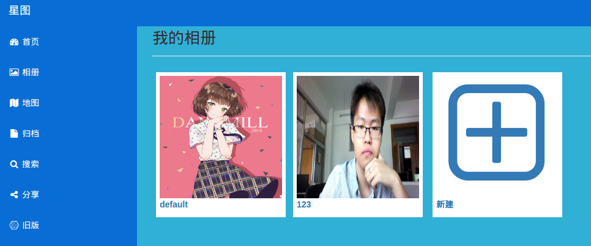
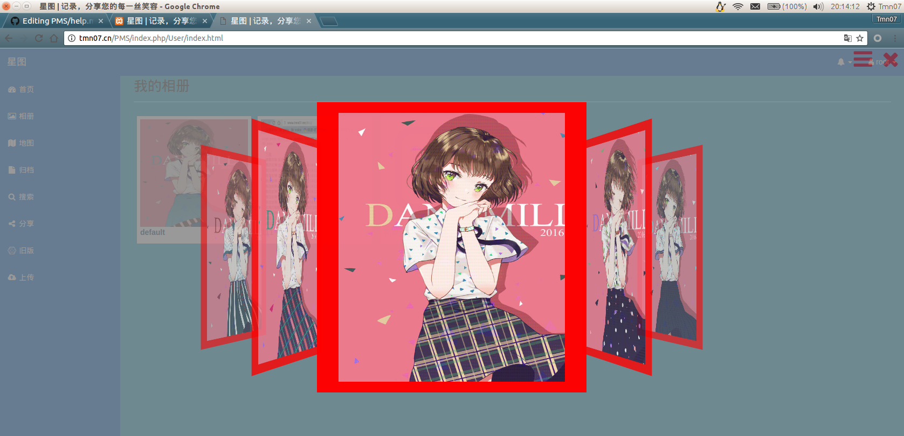
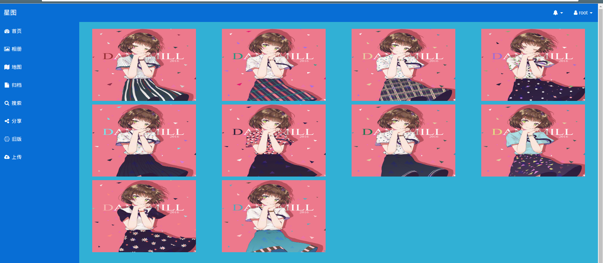
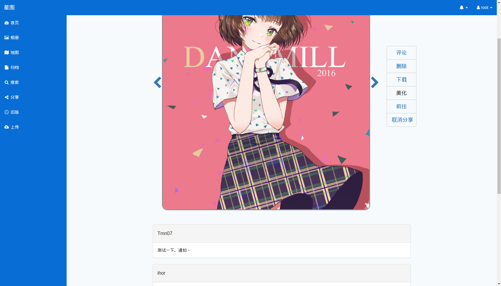
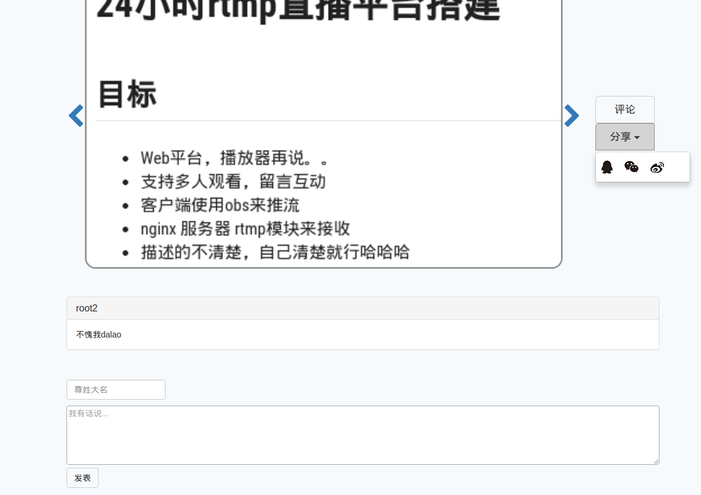
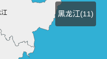
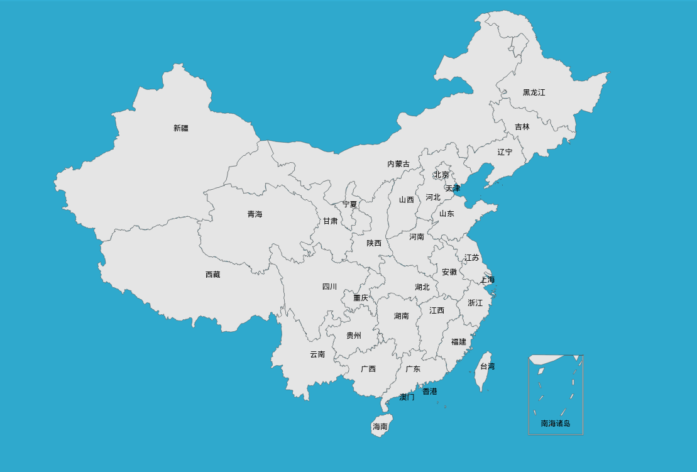
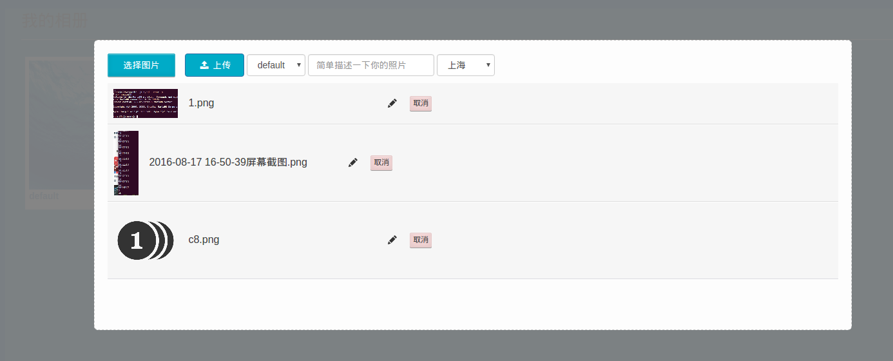
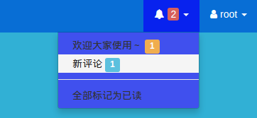
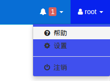

## 帮助

欢迎使用该系统，希望您可以在这里收获便利～

这是一个照片管理系统，相信您已经完成了注册登陆了。

接下来您就可以将您的照片上传到我们的云相册里来，方便管理，随时随地可以查看

### 相册页面

刚注册时，将为您初始化一个default相册

您也可以自己新建相册 

点开相册，进入相册照片查看页面

###  相册照片查看页面
默认已这样的形式加载

点击右上角的标志，也可以切换成普通模式

点击其中一张照片，进入照片详情页面

###  照片详情页面

提供删除下载评论功能

**分享功能**：点击分享后，跳转至一个公开的页面（分享页面），这个页面可以被大家直接访问到，不需要登陆注册就可以访问到的。就像是发到了一条公开的微博。

分享之后的照片，也可以取消分享，或者删除。

**美化功能**：略。。

### 分享页面

分享页面是公开可访问的。我们提供了一些接口，可以分享到qq空间，qq，微信等渠道。

同时你的朋友可以在下方评论留言

### 分享管理页面

将已分享的照片统一显示

### 地图页面

以地理位置来分类。点击后进入 相册照片查看页面

### 上传页面

支持多张图片同时上传，上传时选择相册，地理位置，也可以修改照片名字

### 消息通知

有管理员公告，新评论时，会在这里通知你的～

### 帮助页面

想再次查看帮助在此进入

